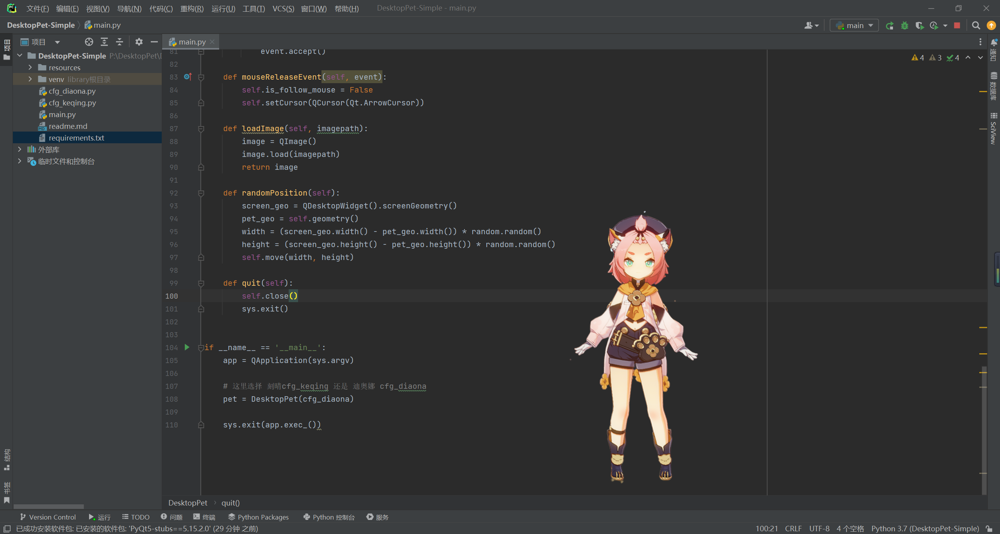
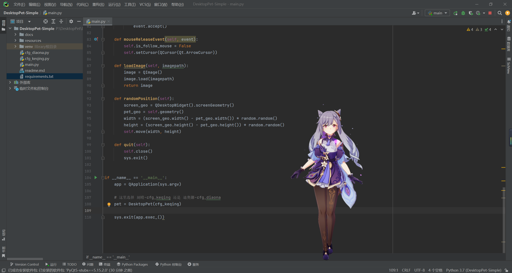

# 桌面宠物

## 1. 基本信息

- 作者: GMCY
- 系列: 桌面宠物
- 仓库: [GitHub](https://github.com/GMCY2020/DesktopPet-Simple) | [Gitee](https://gitee.com/GMCY2020/DesktopPet-Simple)
- 话题(GitHub): [python](https://github.com/topics/python)  \ [mihoyo](https://github.com/topics/mihoyo) \ [genshin](https://github.com/topics/genshin)  \ [desktoppet](https://github.com/topics/desktoppet)
- 创建时间: 2021/01/26

## 2. 介绍

- 使用 `python` 的 `pyqt5` 库编写一个简单的桌面宠物
- 主要有两个角色( `原神` 里面的 `刻晴` 和 `迪奥娜` )
- 原理和放动画片差不多，一张一张图片快速切换
- 就是图片有点多，使得项目大小就有点大
- 而且，好像运行时使用的内存也有点大

## 3. 环境

编辑器
- `PyCharm`

语言
- `Python`

库
- `PyQt5`

## 4. 使用

- 安装依赖 `requirements.txt`
- 运行 `main.py`

## 5. 效果图

迪奥娜

刻晴
